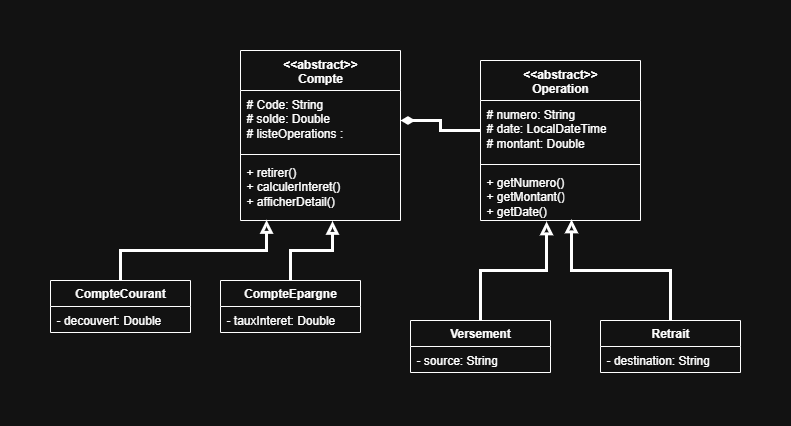

# 🏦 Système de Gestion de Comptes Bancaires

## 📌 Description du projet
Ce projet est une application console développée en **Java 8** permettant la gestion de comptes bancaires.  
L’objectif est de fournir à une banque un système simple et efficace pour automatiser la gestion des opérations courantes :  
- Création de comptes (courant et épargne)  
- Versements  
- Retraits  
- Virements entre comptes  
- Consultation des soldes et historiques d’opérations  

L’application est construite avec une architecture en couches (présentation, métier, utilitaire) et respecte les principes **SOLID**.

---

## 🔗 Liens utiles
- 📂 [Dépôt GitHub](https://github.com/Ibrahim-Nidam/Ibrahim_Nidam_Financia_SGCB.git)  
- 📝 [Tableau Jira](https://ibrahimnidam-22.atlassian.net/jira/software/projects/SCRUM/boards/1?atlOrigin=eyJpIjoiZGYxNjRlMzRkNzZmNGYzZmIzZDY0ODQ0ZmFmMzQ4NjQiLCJwIjoiaiJ9)

---

## 🛠️ Technologies utilisées
- **Java 8** (JDK 1.8)  
- **Java Time API** (`java.time.LocalDateTime`)  
- **Collections Java** (`ArrayList`, `HashMap`)  
- **UUID** pour la génération des identifiants d’opérations  
- **Eclipse IDE** (développement)  
- **Git & GitHub** (gestion de version et partage du code)  

**Bonus (optionnel) :**  
- JDBC + MySQL pour la persistance  
- Stream API et lambdas pour filtrage et affichage  

---

## 📂 Structure du projet


    ├── src/
    │    ├── ui/                # Couche de présentation (menus console)
    │    │   ├── Main.java
    │    │   └── ConsoleUI.java
    │    │
    │    ├── metier/            # Couche métier (logique)
    │    │   ├── compte/
    │    │   │   ├── Compte.java
    │    │   │   ├── CompteCourant.java
    │    │   │   └── CompteEpargne.java
    │    │   │
    │    │   └── operation/
    │    │       ├── Operation.java
    │    │       ├── Versement.java
    │    │       └── Retrait.java
    │    │
    │    └── util/              # Couche utilitaire
    │        └── DateUtils.java
    │        └── ValidationUtils.java
    │        
    ├── docs/               # Documentation & images
    │   └── architecture.png
    │
    └── ReadMe .md


---

## ⚙️ Fonctionnalités principales
✅ Créer un compte courant ou épargne (code auto-généré : `CPT-XXXXX`)  
✅ Effectuer un versement (ex : "Salaire", "Dépôt espèces")  
✅ Effectuer un retrait (ex : "Distributeur ATM", "Chèque")  
✅ Effectuer un virement entre deux comptes  
✅ Consulter le solde d’un compte  
✅ Afficher l’historique des opérations d’un compte  
✅ Gestion des exceptions (montants positifs, format du code, etc.)  
✅ Persistance en mémoire jusqu’à la fermeture de l’application  

---

## 📋 Prérequis
- JDK 1.8 installé (`java -version` doit afficher **1.8.x**)  
- IDE **Eclipse** (ou un autre IDE compatible)  
- Git installé pour cloner le projet  

---

## 🚀 Installation & Exécution
1. **Cloner le dépôt GitHub :**
   ```bash
   git clone https://github.com/Ibrahim-Nidam/Ibrahim_Nidam_Financia_SGCB.git
   cd Ibrahim_Nidam_Financia_SGCB
    ```
2. **Compiler avec javac :**
   ```bash
    javac -d bin $(find src -name "*.java")
    ```
3. **Exécuter l’application :**
   ```bash
   java -cp bin ui.Main
    ```
4. **Générer un fichier JAR exécutable :**
   ```bash
    jar cvfe business.jar ui.Main -C bin .
    java -jar business.jar
    ```

---

📊 Diagramme de classes




---

✅ Critères de performance

- Développé avec Java 8 uniquement
- Respect de l’architecture en couches
- Code clair, bien commenté et suivant les conventions Java
- Gestion des erreurs et validations utilisateur
- Historique Git avec commits réguliers et clairs
- README complet et explicatif

---
📅 Gestion de projet

Durée : 4 jours (16/09/2025 → 19/09/2025)

**Outils :**
- GitHub pour versioning
- JIRA pour gestion des tâches
- Modalités d’évaluation :
- Présentation technique et client
- Démonstration des fonctionnalités
- Questions / Réponses

---

